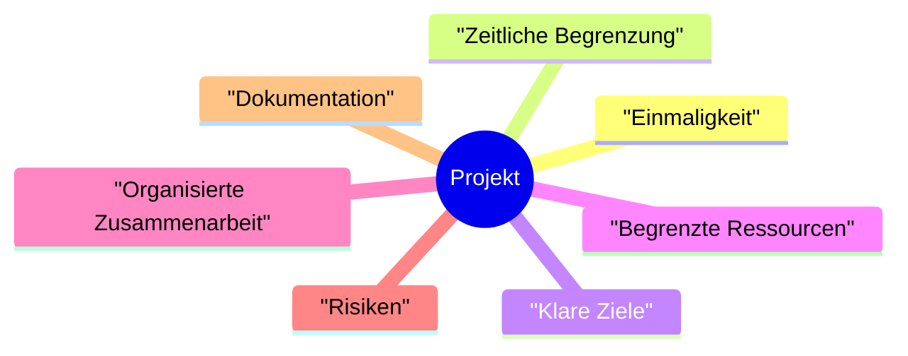
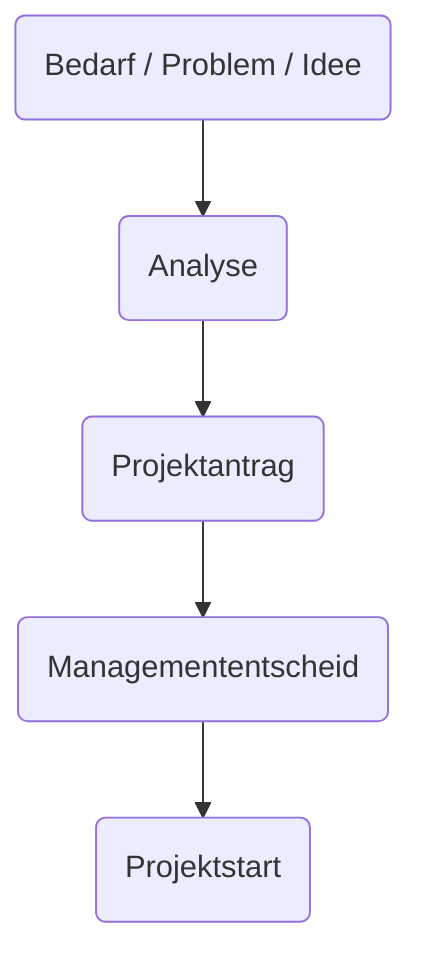
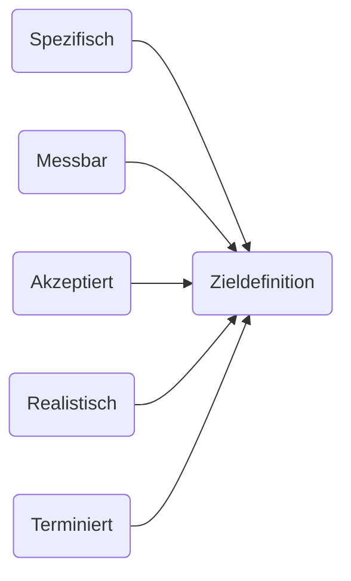
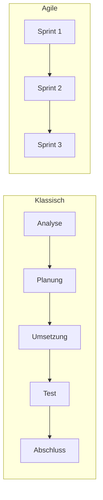
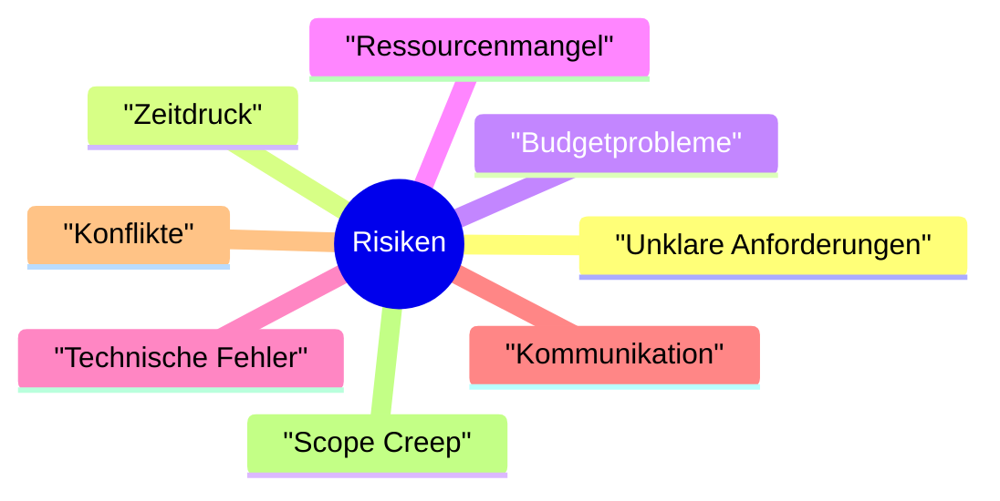

# Projektfragen – Ausführliche Antworten (Markdown)

## 1. Was ist ein Projekt?

Ein Projekt ist ein zeitlich klar begrenztes Vorhaben, das ein einmaliges Ziel verfolgt und nicht Teil des regulären Tagesgeschäfts ist. Es hat immer einen klaren Startpunkt und einen klaren Endpunkt. In einem Projekt geht es darum, eine konkrete Veränderung zu bewirken oder ein neues Ergebnis zu schaffen. Ein Projekt unterscheidet sich stark von Routineaufgaben, da es nicht ständig wiederholt wird. Die Aufgaben in einem Projekt sind oft komplexer und müssen strukturiert geplant werden. Jedes Projekt verfolgt einen bestimmten Zweck, wie etwa die Einführung einer Software oder die Entwicklung eines Produkts. Zu einem Projekt gehört, dass Personen klar definierte Rollen und Verantwortlichkeiten übernehmen. Meist gibt es eine Projektleitung, die Planung und Koordination steuert. Fachpersonen bringen spezifisches Wissen ein und bearbeiten Aufgabenpakete. Projekte arbeiten mit begrenzten Ressourcen wie Zeit, Budget und Personal. Diese Limitierungen machen eine strukturierte Vorgehensweise notwendig. Risiken beeinflussen Projekte stark, da der exakte Verlauf oft nicht vorhersehbar ist. Deshalb ist Risikomanagement ein zentraler Bestandteil. Projekte verlaufen meist in Phasen wie Vorbereitung, Planung, Umsetzung, Kontrolle und Abschluss. Diese Struktur erleichtert die Orientierung und verhindert chaotische Abläufe. Am Ende steht ein Ergebnis, das in den Betrieb übergeben wird. Anschliessend erfolgt eine Auswertung, um Erfolge und Verbesserungsmöglichkeiten festzuhalten. Projekte können sehr klein oder extrem umfangreich sein. Trotz ihrer Unterschiede sind sie immer zielgerichtet, zeitlich begrenzt und organisiert. Deshalb sind Projekte ein wichtiges Werkzeug für Unternehmen, um Veränderungen gezielt umzusetzen.

---

## 2. Wie entstehen Projekte?

Projekte entstehen, wenn ein klarer Bedarf oder ein Problem erkannt wird. Oft zeigt sich, dass ein Prozess nicht mehr gut funktioniert oder modernisiert werden muss. Manchmal gibt es konkrete Schwierigkeiten wie steigende Kosten oder Qualitätsmangel. Auch neue Ideen für Produkte oder Dienstleistungen können Auslöser sein. Ausserdem entstehen Projekte, wenn gesetzliche Vorgaben angepasst werden müssen. Unternehmen starten Projekte, um Chancen zu nutzen, etwa durch Digitalisierung oder neue Technologien. Am Anfang steht eine Analyse der aktuellen Situation. Dabei werden Probleme, Risiken und Möglichkeiten gesammelt. Danach wird überlegt, welche Verbesserungen durch ein Projekt erreicht werden sollen. Anschliessend erfolgt eine Bewertung, ob der Nutzen grösser ist als der Aufwand. Wenn dies zutrifft, wird ein Projektantrag erstellt. Dieser hält Zweck, Ziel, Ressourcenbedarf und erwarteten Nutzen fest. Das Management oder ein Auftraggeber entscheidet dann, ob das Projekt gestartet wird. Werden Ressourcen bewilligt, beginnt die eigentliche Planung. Projekte können auch aus Teams heraus entstehen, etwa durch interne Verbesserungsvorschläge. In modernen Organisationen werden Ideen oft in Innovationsworkshops gesammelt und weiterentwickelt. Krisen wie IT-Ausfälle führen häufig zur schnellen Einleitung eines Projekts. Die digitale Transformation sorgt ebenfalls dafür, dass viele neue Projekte entstehen. Insgesamt gilt: Projekte entstehen immer dann, wenn etwas bewusst verbessert, verändert oder neu geschaffen werden soll.

---

## 3. Wie werden Projektziele definiert?

Projektziele legen fest, was ein Projekt am Ende erreichen soll. Ohne klare Ziele ist der Projekterfolg kaum messbar. Eine verbreitete Methode zur Zieldefinition ist SMART. SMART bedeutet spezifisch, messbar, akzeptiert, realistisch und terminiert. Spezifisch beschreibt klar, was erreicht werden soll. Messbar bedeutet, dass das Ergebnis überprüfbar ist. Akzeptiert heisst, dass das Team das Ziel unterstützt. Realistisch sorgt dafür, dass es mit vorhandenen Ressourcen erreichbar ist. Terminiert legt fest, bis wann das Ziel erreicht werden muss. Die Zieldefinition erfolgt meist in Zusammenarbeit zwischen Projektleitung und Auftraggeber. Stakeholder können ebenfalls Einfluss nehmen. Ziele werden im Projektauftrag schriftlich festgehalten. Es gibt Muss-Ziele, die zwingend erreicht werden müssen. Daneben existieren Kann-Ziele, die optional sind. Ziele müssen widerspruchsfrei sein, damit keine Unsicherheit entsteht. Während des Projekts werden sie regelmässig überprüft. Bei geänderten Rahmenbedingungen kann eine Anpassung nötig sein. Gut formulierte Ziele erleichtern die Planung und helfen, Entscheidungen zu treffen. Sie verhindern Missverständnisse und sorgen für ein gemeinsames Verständnis. Am Ende des Projekts dienen sie als Grundlage für die Bewertung des Erfolgs. Klare Ziele fördern Motivation und Orientierung im Team. Sie sind damit einer der wichtigsten Bestandteile eines erfolgreichen Projekts.

---

## 4. Welche Vorgehensmodelle für Projekte gibt es?

Es existieren zahlreiche Vorgehensmodelle, die je nach Projekttyp eingesetzt werden. Ein klassisches Modell ist das Wasserfallmodell. Hier werden Phasen wie Analyse, Planung, Umsetzung und Test in fester Reihenfolge durchlaufen. Dieses Modell eignet sich für stabile Anforderungen. Ein weiteres klassisches Modell ist das V-Modell, das Entwicklungs- und Testphasen spiegelbildlich gegenüberstellt. Dadurch wird Qualitätssicherung systematisch eingebunden. Agile Modelle wie Scrum arbeiten hingegen iterativ. In Sprints von wenigen Wochen entstehen regelmässig funktionsfähige Zwischenergebnisse. Nach jedem Sprint gibt es Feedback, das in die nächste Phase einfliesst. Kanban ist ein weiteres agiles Modell, das auf Visualisierung und kontinuierliche Verbesserung setzt. In hybriden Modellen werden klassische und agile Elemente kombiniert. Ein weiteres verbreitetes Modell ist IPERKA: Informieren, Planen, Entscheiden, Realisieren, Kontrollieren, Auswerten. Die Wahl des Vorgehensmodells hängt von Komplexität, Anforderungen und Teamstruktur ab. Klassische Modelle bieten hohe Planbarkeit. Agile Modelle bieten Flexibilität und schnelle Reaktionsfähigkeit. Hybride Modelle nutzen Vorteile aus beiden Welten. Vorgehensmodelle sorgen für bessere Struktur, klare Verantwortlichkeiten und eine geordnete Arbeitsweise. Sie helfen, Risiken zu minimieren und die Qualität der Ergebnisse zu erhöhen. Insgesamt tragen sie dazu bei, Projekte effizient und nachvollziehbar umzusetzen.

---

## 5. Typische Herausforderungen bei Projekten

Projekte stehen regelmässig vor zahlreichen Herausforderungen. Ein häufiges Problem sind unklare Anforderungen. Werden sie nicht sauber definiert, entstehen später Missverständnisse. Ein weiteres Risiko ist Zeitdruck, der durch schlechte Planung entsteht. Budgetüberschreitungen passieren oft, wenn Kosten unterschätzt werden. Auch Ressourcenmangel, etwa fehlendes Personal, ist typisch. Kommunikationsprobleme führen dazu, dass Informationen verloren gehen. Scope Creep ist ein gefährlicher Effekt, bei dem der Projektumfang unbemerkt wächst. Technische Probleme wie Softwarefehler können den Ablauf stark verlangsamen. Konflikte im Team erschweren die Zusammenarbeit. Unklare Rollenverteilung führt dazu, dass Verantwortlichkeiten fehlen. Mangelnde Erfahrung der Projektleitung wirkt sich negativ auf Planung und Kontrolle aus. Schlechte Dokumentation führt dazu, dass Wissen verloren geht. Externe Faktoren wie Lieferverzögerungen können Projekte erheblich beeinflussen. Internationale Teams müssen kulturelle Unterschiede überwinden. Unterschiedliche Zeitzonen erschweren Abstimmungen. Fehlendes Risikomanagement verursacht oft zusätzliche Probleme. Motivationsverlust im Team kann die Qualität mindern. Unrealistische Erwartungen der Stakeholder führen zu Druck und Frustration. Projektsuccess hängt stark von guter Planung und Kommunikation ab. Regelmässige Kontrollen helfen, Probleme früh zu erkennen. Mit der richtigen Vorgehensweise lassen sich Herausforderungen meistern und das Projekt erfolgreich abschliessen.

